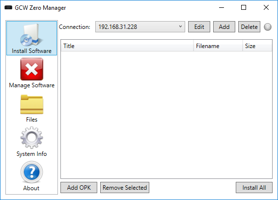
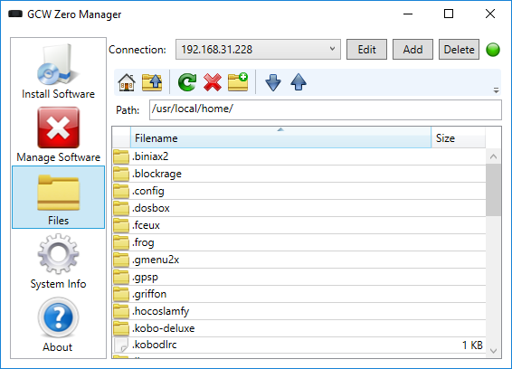

# GCW Zero Manager

GCW Zero Manager is a Windows application to make it easier to manage your GCW Zero console.

It can do the following:
* Install and uninstall apps
* Browse files
* Download and upload files
* Get system information including the system log

## Screenshots

